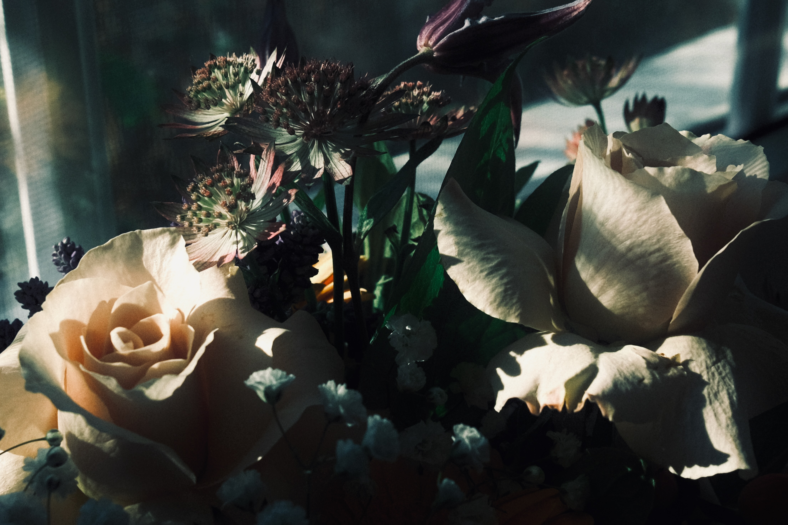
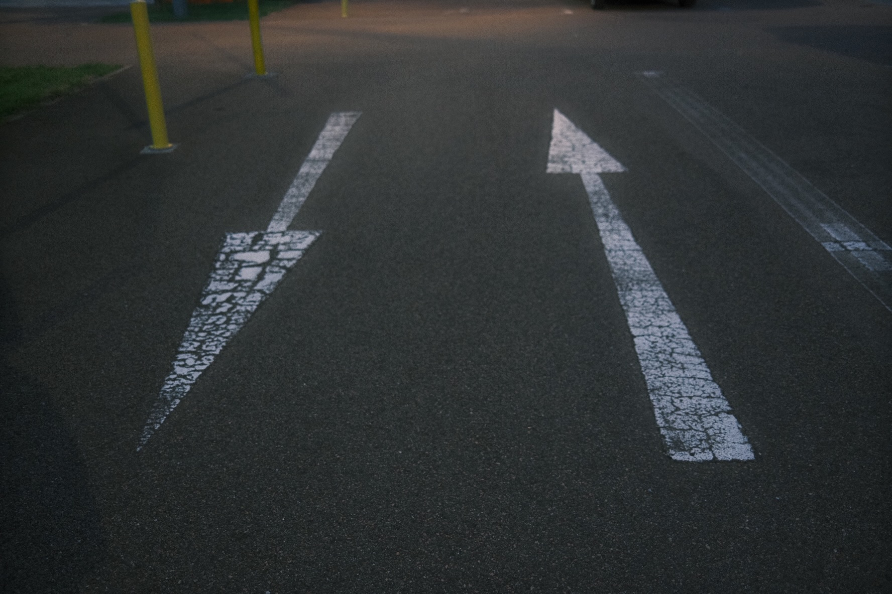

## About Me
I'm currently a <a href="https://www.tum.de/studium/studienangebot/detail/robotics-cognition-intelligence-master-of-science-msc" target="_blank"> Robotics, Cognition and Intelligence</a> master student at <a href="https://www.tum.de" target="_blank"> Technical University of Munich</a>'s <a href="https://www.cit.tum.de/cit/startseite/" target="_blank"> School of CIT</a>. I obtained my bachelor degree in Electronic Science and Technology from <a href="https://en.xidian.edu.cn" target="_blank"> Xidian University</a>.

## Research Interests
- **Artificial Intelligence:** 
- **Machine Learning:** 
- **Computer Vision:** 
- **Robot Perception:** 

## Projects

### Unsupervised 3D Reconstruction From Monocular Videos

    <!-- Always visible part -->
    We tried to improve a learning-based framework named NeuralRecon for real-time dense 3D geometry reconstruction from monocular video. For the supervised learning phase, the model is optimized by differentiating the weights of input features by leveraging the transformer or single attention layer.

    <!-- Toggle button -->
    <button id="toggleButton1" onclick="toggleDescription('projectDescription1', 'toggleButton1')" style="cursor: pointer;">Show/Hide More</button>

    <!-- Collapsible part -->
    

        Meanwhile, we calculate the supervised learning depth loss in the original NeuralRecon's loss calculation method and implement it by utilizing a differentiable renderer. For the test time, we introduce a robust photometric consistency loss to optimize the model for better results. Experiments on ScanNet demonstrate improved results compared to NeuralRecon. Further by replacing the training loss with the unsupervised robust photometric consistency loss, unsupervised learning-based 3D reconstruction is possible.
    

[Code](https://github.com/WenzhaoTang/online_fusion) | [Pipeline](./assets/img/unsup_recon.png)
<!-- JavaScript function -->

### Automatic 3D Registration with Invisible Textures

    <!-- Always visible part -->
    Aiming to identify point correspondences of rigid 3D objects to a canonical model, particularly for monochromatic or low-texture objects, we enhanced correspondence detection through the application of artificial textures and a layer of fluorescent paint, preserving the object's original texture. 

    <!-- Toggle button -->
    <button id="toggleButton2" onclick="toggleDescription('projectDescription2', 'toggleButton2')" style="cursor: pointer;">Show/Hide More</button>

    <!-- Collapsible part -->
    

        Faced with the limitations of existing datasets, we introduced synthetic datasets to train robust models and evaluated classical template-matching techniques. Concurrently, we investigated various neural network architectures, assessing their performance on the TLESS-Dataset using the Surfemb method. After finalizing the dataset format, we created datasets featuring both non-textured and textured objects and commenced training. We then assessed the models' applicability and accuracy through both qualitative and quantitative evaluations. Moving forward, we plan to refine our models, leveraging ongoing feedback and considering the integration of more advanced architectures to achieve our goals.
    

[Code](https://github.com/WenzhaoTang/3D-Registration) | [Synthetic Dataset](./assets/img/3Dreg.JPG)
<!-- JavaScript function -->

### Stereo Reconstruction

    <!-- Always visible part -->
    This project outlines a comprehensive pipeline to compare various stereo reconstruction methods, already successfully tested on two datasets. The pipeline starts with camera calibration to eliminate image distortion, followed by key point extraction and matching for image rectification.  

    <!-- Toggle button -->
    <button id="toggleButton3" onclick="toggleDescription('projectDescription3', 'toggleButton3')" style="cursor: pointer;">Show/Hide More</button>

    <!-- Collapsible part -->
    

        Dense stereo matching is then employed to calculate disparity maps, which are used to extract depth information for the generation of the final 3D model. Algorithms such as StereoSGBM and StereoBM will be implemented for stereo matching, and post-filtering techniques will be used to enhance the quality of the disparity maps. The depth information is then converted to 3D points, which are integrated into a complete 3D model using techniques like ICP or other improved algorithms. The overarching goal is to compare the effectiveness of different stereo reconstruction methods in order to identify the optimal solution for 3D modeling.
    

[Code](https://github.com/WenzhaoTang/Stereo-Reconstruction) | [Pipeline](./assets/img/Stereo.png)
<!-- JavaScript function -->

### Language Embedded Radiance Fields (LERFs) with Color and Geometry Manipulation

    <!-- Always visible part -->
    This project aimed to extend the capabilities of Language Embedded Radiance Fields (LERF) to be able to manipulate an object’s geometry and color given a scene by undertaking a comprehensive investigation into backbone replacement and the integration of CLIP-driven manipulation. 

    <!-- Toggle button -->
    <button id="toggleButton4" onclick="toggleDescription('projectDescription4', 'toggleButton4')" style="cursor: pointer;">Show/Hide More</button>

    <!-- Collapsible part -->
    

        The Nerfacto backbone in LERF was to be replaced with either TensoRF and mip-NeRF to achieve improved rendering results. Evaluation results revealed that mip-NeRF’s rendering time was longer and yielded inferior outcomes on both normal and synthetic data. However, TensoRF showcased remarkable performance on synthetic data, outperforming existing models attempting similar tasks with a PSNR of 34.31 and SSIM of 0.966. Nevertheless, TensoRF exhibited worse performance on real world scene data, highlighting potential limitations. Concurrently, the project successfully implemented CLIP-driven color manipulation, allowing intuitive object editing within the rendered scenes using text prompts. The findings provide valuable insights into backbone selection for LERF and offer exciting possibilities for interactive scene manipulation through natural language. This project lays the groundwork for future research and advancements in text-to-scene generation.
    

[Code](https://github.com/WenzhaoTang/EditLeRF) | [Pipeline](./assets/img/editlerf.png)
<!-- JavaScript function -->

## Scholarships and Awards
- **Study Abroad Scholarship,** China Scholarship Council, 2019
- **First-class Scholarship,** Xidian University, 2018
- **Merit Student of** Xidian University, 2018
- **Second Prize in Chinese College Mathematics Competitions,** Chinese Mathematical Society, 2018

## Photographs
I have a passion for photography, and I'd like to share a selection of the photos I've captured. For a broader collection, feel free to explore my [500px profile](https://500px.com/p/watsontang?view=photos).

## Musics
I have a deep passion for music and have even set up my own cozy music studio. This is where I indulge in singing and mix my own tracks. Dive in to explore my musical journey at <a href="https://music.163.com/#/artist?id=34592658" target="_blank"> NetEase Cloud Music</a>!

    
    
    

## Misc.
<ul>
  <li>During my undergrad, I earned a spot among the Campus Top Ten Singers. This experience not only expanded my musical horizons but also introduced me to many talented peers.</li> 
  <li>I passionately support balanced feminist ideals, aim to promote diversity and equality, and believe in valuing everyone's unique contributions regardless of gender.</li>
</ul>
